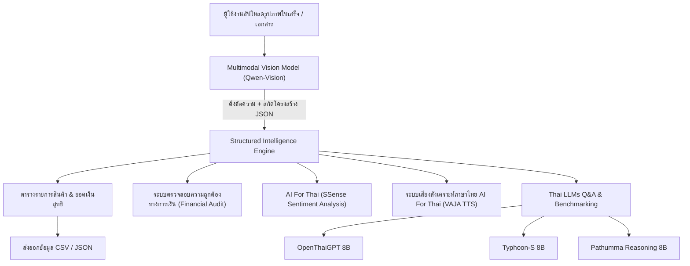

# ThaiDocAI: ระบบบริหารและวิเคราะห์เอกสาร/ใบเสร็จอัจฉริยะ
โครงงานปัญญาประดิษฐ์และ Machine Learning ประจำภาคการศึกษา (CIT0013 Machine Learning)

---

## 👨‍💻 ข้อมูลผู้พัฒนา & สถาบัน
* **ผู้จัดทำ:** IT67 Information
* **รหัสนักศึกษา / อีเมล:** 671413006@crru.ac.th
* **สาขาวิชา/องค์กร:** มหาวิทยาลัยราชภัฏเชียงราย
* **อาจารย์ผู้สอน/วิชา:** CIT0013 Machine Learning

---

## 🎯 วัตถุประสงค์ของโครงงาน (Project Objectives)
1. **เพื่อแก้ปัญหาคอขวดของการจัดการเอกสาร (Document Bottleneck):** ลดระยะเวลาและข้อผิดพลาดในการบันทึกข้อมูลใบเสร็จ สลิปโอนเงิน และเอกสารสำคัญเข้าสู่ระบบบัญชี/ERP
2. **เพื่อสร้างระบบ Multimodal AI Pipeline ภาษาไทย:** บูรณาการการทำงานร่วมกันระหว่าง **Computer Vision (OCR)**, **Natural Language Processing (Thai LLMs)**, และ **Speech Synthesis (Thai TTS)**
3. **เพื่อเปรียบเทียบประสิทธิภาพโมเดลภาษาไทย (Model Benchmarking):** ทดสอบและประเมินผลลัพธ์ระหว่าง OpenThaiGPT, Typhoon และ Pathumma ในบริบทการวิเคราะห์เอกสารจริง

---

## 🏛️ สถาปัตยกรรมระบบ (System Architecture & AI Services)



### 1. บริการจากเครือข่าย ThaiLLM (`api.thaillm.or.th`):
* **Vision Document OCR (`qwen3.5-9b`):** สกัดข้อความภาษาไทย/อังกฤษ แปลงข้อมูลเอกสารที่ไม่มีโครงสร้าง (Unstructured) ให้อยู่ในรูป **JSON มาตรฐาน** (ชื่อร้าน, วันที่, รายการสินค้า, ราคา, VAT, ยอดรวม)
* **Thai LLM Question Answering & Reasoning:**
  * **OpenThaiGPT-ThaiLLM-8B-Instruct-v7.2:** โมเดลพื้นฐานสำหรับตอบคำถามและสรุปใจความเอกสาร
  * **Typhoon-S-ThaiLLM-8B-Instruct:** โมเดลประมวลผลคำตอบภาษาไทยที่เป็นธรรมชาติ
  * **Pathumma-ThaiLLM-qwen3-8b-think-3.0.0:** โมเดลเน้นการคิดวิเคราะห์เชิงตรรกะ (Step-by-step Reasoning)

### 2. บริการจาก AI For Thai NECTEC (`api.aiforthai.in.th`):
* **VAJA (Thai Text-to-Speech):** สังเคราะห์เสียงพูดภาษาไทย รายงานสรุปสถานะการประมวลผลและยอดเงินให้ผู้ใช้ฟังแบบอัตโนมัติ (เลือกเสียงชาย/หญิงได้)
* **SSense (Thai Sentiment Analysis):** วิเคราะห์อารมณ์และโทนข้อความในเอกสาร (Positive / Neutral / Negative) เพื่อคัดกรองความน่าเชื่อถือ

---

## 🌟 ฟีเจอร์ระดับ Enterprise ที่โดดเด่น (Key Features)

| ฟีเจอร์ | รายละเอียดการทำงาน | คุณค่าทางธุรกิจ / วิชาการ |
|---|---|---|
| **1. Structured Table & Export** | ดึงรายการสินค้าใส่ DataFrame พร้อมปุ่มกดดาวน์โหลด **CSV** และ **JSON** ทันที | นำไปเชื่อมต่อระบบ ERP/บัญชีได้จริง |
| **2. Financial Logic Audit** | ใบเสร็จ: ตรวจผลรวมรายการกับยอดก่อนภาษี และตรวจยอดก่อนภาษี + VAT - ส่วนลด + ค่าใช้จ่ายเพิ่มเติมกับยอดสุทธิ; สลิปโอน: ตรวจยอดโอน + ค่าธรรมเนียมกับยอดหักบัญชี โดยไม่รวมค่าธรรมเนียมเข้ายอดที่ผู้รับได้รับ | ช่วยชี้ความคลาดเคลื่อน โดยผู้ใช้ต้องเทียบผล OCR กับภาพต้นฉบับก่อนยืนยัน |
| **3. Model Benchmarking Mode** | ยิงคำถามทดสอบไปยัง 3 โมเดลพร้อมกัน แสดงความเร็ว (Latency วินาที) และข้อความเทียบกัน | ใช้ทำตารางวิเคราะห์ผลในรายงานโครงงาน |
| **4. Thai Voice Assistant (VAJA)** | อ่านออกเสียงข้อความสรุปเป็นภาษาไทย | อำนวยความสะดวกสำหรับผู้พิการทางสายตาหรือการใช้งานแบบ Hands-free |
| **5. Interactive Document Chat** | มีปุ่มถามด่วน (ยอดเงิน, วันที่, สินค้าแพงสุด) และช่องแชตอิสระ | ผู้บริหารสามารถพิมพ์ถามเจาะลึกได้ทันที |

---

## 💻 วิธีการติดตั้งและรันระบบ (Setup & Execution)

### 1. ติดตั้งไลบรารีที่จำเป็น
```bash
pip install -r requirements.txt
```

### 2. รันแอปพลิเคชัน
```bash
python -m streamlit run app.py
```
เปิดบราวเซอร์ที่: `http://localhost:8501`
