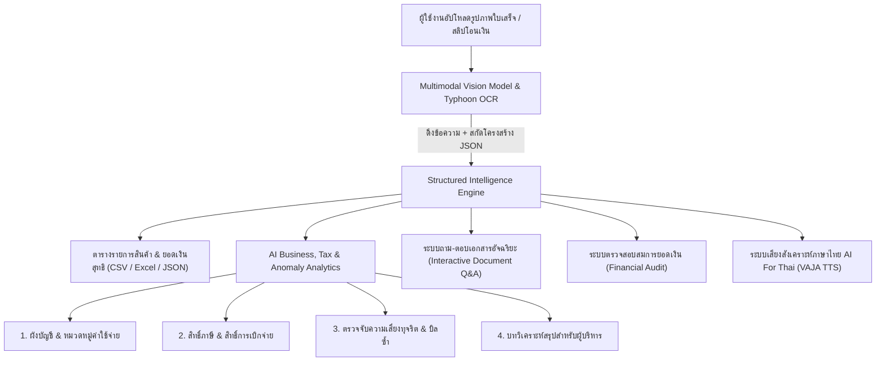

# ThaiDocAI: ระบบบริหารและวิเคราะห์เอกสาร/ใบเสร็จอัจฉริยะ
โครงงานปัญญาประดิษฐ์และ Machine Learning ประจำภาคการศึกษา (CIT0013 Machine Learning)

---

## 👨‍💻 ข้อมูลผู้พัฒนา & สถาบัน
* **ผู้จัดทำ:** IT67 Information
* **รหัสนักศึกษา / อีเมล:** 671413006@crru.ac.th
* **สาขาวิชา/องค์กร:** มหาวิทยาลัยราชภัฏเชียงราย
* **อาจารย์ผู้สอน/วิชา:** CIT0013 Machine Learning

---

## 🎯 วัตถุประสงค์ของโครงงาน (Project Objectives)
1. **เพื่อแก้ปัญหาคอขวดของการจัดการเอกสาร (Document Bottleneck):** ลดระยะเวลาและข้อผิดพลาดในการบันทึกข้อมูลใบเสร็จ สลิปโอนเงิน และเอกสารสำคัญเข้าสู่ระบบบัญชี/ERP
2. **เพื่อสร้างระบบ Multimodal AI Pipeline ภาษาไทย:** บูรณาการการทำงานร่วมกันระหว่าง **Computer Vision (OCR)**, **Natural Language Processing (Thai LLMs)**, และ **Speech Synthesis (Thai TTS)**
3. **เพื่อวิเคราะห์ข้อมูลเชิงลึกทางธุรกิจ บัญชี และภาษี (AI Business, Tax & Anomaly Analytics):** ประยุกต์ใช้ AI ในการจำแนกผังบัญชีอัตโนมัติ ตรวจสอบความถูกต้องทางภาษีสรรพากร และตรวจจับความเสี่ยงทุจริตในเอกสารเพื่อนำไปใช้งานได้จริง

---

## 🏛️ สถาปัตยกรรมระบบ (System Architecture & AI Services)



### 1. บริการจากเครือข่าย ThaiLLM (`api.thaillm.or.th`):
* **Vision Document OCR (`qwen3.5-9b`):** สกัดข้อความภาษาไทย/อังกฤษ แปลงข้อมูลเอกสารที่ไม่มีโครงสร้าง (Unstructured) ให้อยู่ในรูป **JSON มาตรฐาน** (ชื่อร้าน, วันที่, รายการสินค้า, ราคา, VAT, ยอดรวม)
* **Thai LLM Question Answering & Reasoning (`Typhoon-S-ThaiLLM-8B-Instruct`):** โมเดลตอบคำถามภาษาไทยอัจฉริยะ ตอบได้ครอบคลุมทั้งรายการสินค้า ราคา ผลต่าง คำนวณยอดเงิน ผู้ซื้อ ผู้ขาย และข้อมูลทางภาษี

### 2. บริการจาก AI For Thai NECTEC (`api.aiforthai.in.th`):
* **VAJA (Thai Text-to-Speech):** สังเคราะห์เสียงพูดภาษาไทย รายงานสรุปสถานะการประมวลผลและยอดเงินให้ผู้ใช้ฟังแบบอัตโนมัติ (เลือกเสียงชาย/หญิงได้)
* **SSense (Thai Sentiment Analysis):** วิเคราะห์อารมณ์และโทนข้อความในเอกสาร (Positive / Neutral / Negative) เพื่อคัดกรองความน่าเชื่อถือ

---

## 🌟 ฟีเจอร์ระดับ Practical AI ที่นำไปใช้งานได้จริง (Key Features)

| ฟีเจอร์ | รายละเอียดการทำงาน | คุณค่าทางธุรกิจ / ภาคปฏิบัติ |
|---|---|---|
| **1. AI Expense Categorization & Account Code** | AI วิเคราะห์ชื่อร้านและรายการสินค้าเพื่อจัดหมวดหมู่ค่าใช้จ่ายและกำหนดรหัสบัญชีมาตรฐาน (เช่น 5101-01, 5102-01) พร้อมสร้าง Narration สำหรับลงสมุดรายวัน | ลดเวลาของนักบัญชีและ SME ในการคีย์ผังบัญชีด้วยมือ นำเข้าโปรแกรมบัญชีได้ทันที |
| **2. Tax & Reimbursement Compliance Check** | ตรวจสอบประเภทเอกสาร (เต็มรูป/อย่างย่อ/สลิป), ตรวจหาเลขประจำตัวผู้เสียภาษี 13 หลัก และประเมินสิทธิ์การเคลมภาษีซื้อ (VAT 7%) | ป้องกันความเสี่ยงจากการถูกสรรพากรเบี้ยปรับ และช่วยให้พนักงานทราบสิทธิ์การเบิกจ่ายทันที |
| **3. Fraud & Anomaly Risk Detection** | ตรวจสอบความผิดปกติ: บิลซ้ำซ้อนในชุด, วันที่ในอนาคต/เก่าเกินกำหนด, ยอดเงินกลมผิดปกติ, และความไม่สอดคล้องของสมการ VAT | สกัดกั้นการทุจริตเบิกเงินซ้ำ (Double Reimbursement) และเอกสารปลอมในองค์กร |
| **4. Executive Insights & Cost Optimization** | สรุปภาพรวมการใช้จ่ายและให้คำแนะนำเชิงกลยุทธ์ เช่น การขอใบกำกับเต็มรูปเพื่อประหยัด VAT | แปลงเศษกระดาษให้กลายเป็น Business Intelligence (BI) สำหรับผู้บริหาร |
| **5. Batch Portfolio Analytics** | รวมผลวิเคราะห์เมื่ออัปโหลดหลายเอกสารพร้อมกัน แสดงสัดส่วนค่าใช้จ่าย และตรวจจับบิลซ้ำข้ามไฟล์ | จัดการชุดเอกสารจำนวนมากได้อย่างรวดเร็วในหน้าจอเดียว |
| **6. Universal Document Q&A** | ถาม-ตอบข้อมูลเอกสารภาษาไทยได้อย่างอิสระและครบถ้วน ทั้งรายการสินค้า ราคาสูงสุด/ต่ำสุด ยอดเงิน ภาษี และคู่ค้า | ค้นหาข้อมูลเชิงลึกในเอกสารได้โดยไม่ต้องกวาดตาอ่านเอง |
| **7. Export to Excel, CSV & JSON** | รองรับการส่งออกข้อมูลที่ยืนยันแล้วทั้งรายฉบับและแบบชุดรวม (CSV UTF-8 BOM, Excel .xlsx, JSON) | นำไปเชื่อมต่อระบบ ERP, Excel หรือโปรแกรมบัญชีได้ทันที |

---

## 💻 วิธีการติดตั้งและรันระบบ (Setup & Execution)

### 1. ติดตั้งไลบรารีที่จำเป็น
```bash
pip install -r requirements.txt
```

### 2. รันแอปพลิเคชัน
```bash
python -m streamlit run app.py
```
เปิดบราวเซอร์ที่: `http://localhost:8501`
